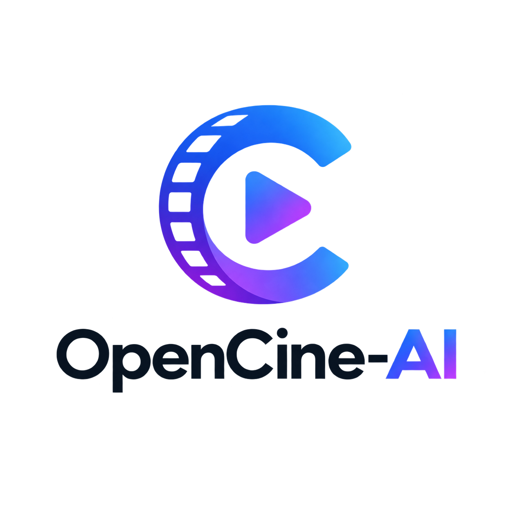
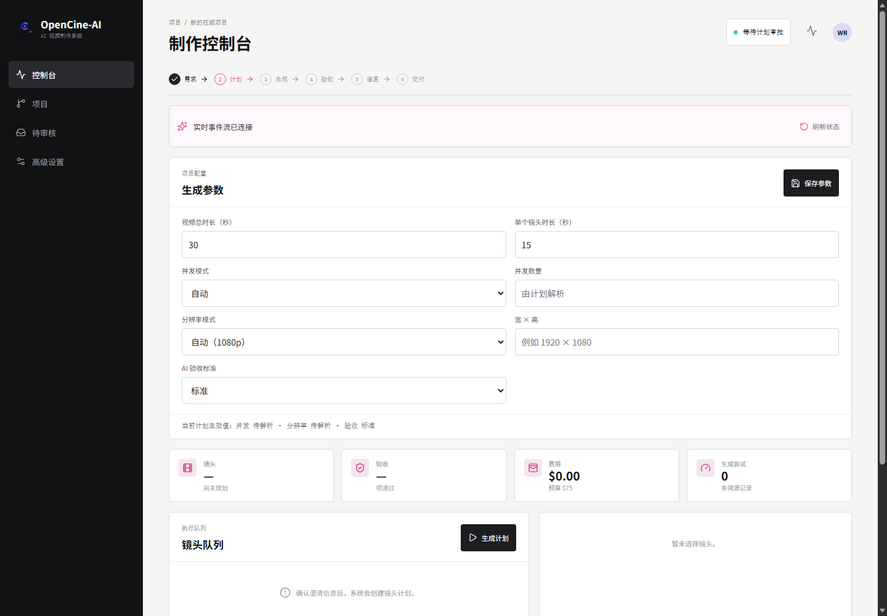
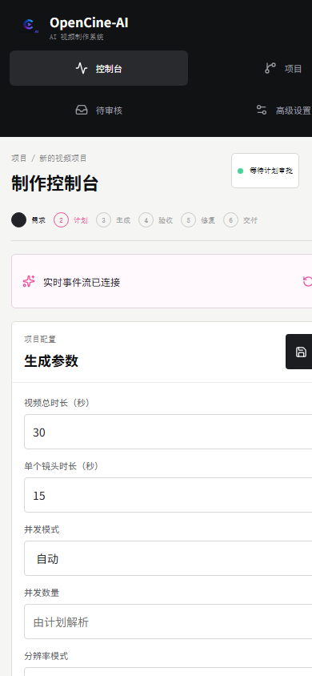

# OpenCine-AI

<p align="center">
  
</p>

<p align="center">
  <a href="https://github.com/wrhc2010/OpenCine-AI/releases"></a>
  <a href="https://github.com/wrhc2010/OpenCine-AI/blob/main/LICENSE"></a>
  
  
</p>

一个开源、模型无关的 **OpenCine-AI 视频制作** 编排系统。你只需要提供创意简报，它就会把需求整理成可版本化的制作计划，拆分场景与镜头，为每个镜头生成提示词和验收标准，调用视频模型，逐项检查结果，在失败后诊断原因并自动修复，最后完成连续性检查、音视频组装和交付。遇到重要决策时，系统会暂停并请求人工确认。

## 产品预览

<p align="center">
  
  
</p>

桌面端聚焦项目配置、计划审批、镜头队列和验收状态；移动端保留核心导航与参数编辑，适合快速查看运行进度。

本项目从一开始就坚持 **Agent-first（智能体优先）**：时间线只是执行结果，不是主要控制面板。项目状态、事件日志、来源追踪和质量门禁由本仓库负责维护；具体模型通过稳定的 Provider 适配器接入，因此不会被某一家模型或平台锁定。

## 当前状态

仓库目前包含 Phase 0/1 的工程基础，以及一条可重复运行的端到端参考闭环：

- 面向 Brief、Plan、Scene、Shot、Bible、Reference 和 Acceptance Criteria 的 Creative IR
- 需求澄清检测与审批门禁
- 覆盖 LLM、VLM Judge、视频、Reference、语音、音乐、音效、口型同步和组装的 Provider 协议
- 兼容 Fal/Replicate 风格的异步 HTTP 适配器，以及 ComfyUI 适配器
- 基于 SQLite 事件溯源的开发存储，并预留 PostgreSQL 存储边界
- 重试、预算、租约、幂等和 checkpoint 基础能力
- 单调递增的项目快照版本，以及 compare-and-swap 冲突检测
- 持久化 SQLite 队列、Redis Streams consumer group 适配器、Worker 租约和故障恢复
- Fail-closed（失败即阻断）的逐项验收、结构化诊断和修复动作
- 跨镜头连续性检查与确定性的 Mock Provider
- 可选 FastAPI API 和中文 React/Vite 操作控制台
- 为 API、Worker、PostgreSQL、Redis 和 MinIO 提供的 Docker Compose 服务

Mock Provider 的存在是有意为之：贡献者无需购买模型额度，就可以在本地跑通 `Plan → Generate → Judge → Diagnose → Refine → Regenerate → Verify → Assemble` 全流程。

## 快速开始

### 核心演示（仅 Python）

```bash
python -m venv .venv
.venv\Scripts\activate       # PowerShell（Windows）
pip install -e ".[dev]"
python -m video_director.cli demo --shots 3
pytest
```

### API 与 Web 控制台

```bash
pip install -e ".[api]"
uvicorn video_director.api:app --reload
cd web
npm install
npm run dev
```

API 默认使用本地 SQLite 文件（`.data/director.db`）和 Mock Provider。部署到生产环境时，请配置 `DIRECTOR_DATABASE_URL`、`REDIS_URL`、`OBJECT_STORAGE_ENDPOINT` 以及各模型 Provider 的凭证。

### Docker Compose

```bash
# 使用 GitHub Container Registry 中的 v0.1.1 发布镜像
docker compose pull api worker web
docker compose up -d

# 或从当前工作区重新构建镜像
docker compose up -d --build
```

发布镜像为 `ghcr.io/wrhc2010/opencine-ai-api:v0.1.1` 和
`ghcr.io/wrhc2010/opencine-ai-web:v0.1.1`；每次发布版本也会同步更新
`latest` 标签。Compose 通过 `OPENCINE_IMAGE_TAG` 选择镜像版本。

启动后访问：

- WebUI：`http://localhost:3000`
- API：`http://localhost:8000`
- MinIO 控制台：`http://localhost:9001`

首次打开 WebUI 会要求设置管理员账号和密码。系统不会创建固定默认账号；账号、会话和全局设置保存在数据库中。API 仍保持开放，认证只保护 WebUI 会话。

### 中文配置体验

WebUI 的“项目配置”可以调整视频总时长、单个镜头时长、并发、分辨率和 AI 验收标准。并发、分辨率和验收支持自动、预设或自定义值；计划生成后会展示实际生效值，修改项目参数会使计划回到审批状态。

全局设置分为“普通设置”和“高级设置”：普通设置管理 Provider、模型、默认预算、默认并发和默认验收策略；高级设置管理数据库、Redis、对象存储、认证、Host、CORS、限流及安全策略。配置优先级为：

```text
项目配置 > 全局设置 > 环境变量 > 内置默认值
```

API Key 只显示“已配置”，不会回显原文。数据库、Redis、对象存储和 Provider 凭证等连接配置在新任务或服务重启后完全生效，请勿将真实凭证提交到 Git。

### Mock、ComfyUI 与外网访问

默认 Provider 是无需凭证的 Mock，可直接运行完整质量闭环。需要真实生成时，将 `VIDEO_PROVIDER` 设置为 `fal`、`replicate` 或 `comfyui`，并按 `.env.example` 配置对应地址和凭证。未配置真实 LLM/VLM 时，Mock/Replay 仍可运行，语义验收可选择“无”。

Compose 不映射 MinIO 的 `9000` S3 API，该端口仅供容器网络内的 API/Worker 使用；宿主机只暴露 MinIO 控制台 `9001`。通过 FRP 或反向代理对外提供服务时，建议只转发 Web `3000`，并在启用 Host 检查时配置 `web/.env.local` 中的允许域名。

## 架构

```text
创意简报
      │
澄清 Agent ── 人工门禁 ── 计划 Agent ── 人工门禁
      │                                  │
      └──────── Creative IR / Bible / 验收标准
                                         │
          调度器 ── Provider 适配器 ── 音视频 Artifact
             │                            │
             └── Judge（逐项证据）── 诊断 / 修复
                                             │
                              连续性检查 ── 组装 ── 人工交付门禁
```

公共协议位于 `src/video_director/providers/base.py`，领域对象位于 `src/video_director/schemas.py`。这些接口不暴露 LangGraph、FastAPI、SQLAlchemy 或任何具体模型厂商的类型，因此替换框架或 Provider 时不需要重写生产状态机。

## 设计原则

1. **失败即阻断。** 缺少证据、Judge 返回格式错误、Provider 超时或出现未知验收项时，结果都不能被默认为通过，必须进入诊断或人工升级。
2. **每个决策都可追溯。** Prompt、参数、Reference、Provider/模型版本、请求 ID、成本、证据和修复动作都会以追加记录保存。
3. **有边界的自主性。** Agent 可以选择修复方式，但重试次数、预算和人工门禁是硬策略，不能被模型绕过。
4. **局部上下文，项目级记忆。** 每个镜头只接收相关场景和 Bible 上下文；项目通过紧凑的 Artifact 索引和事件快照保存全局记忆，避免无限回放对话。
5. **优先使用适配器，而不是直接 Fork。** 只有 MIT/Apache-2.0 代码才有资格直接复用；没有明确许可证的研究仓库只用于参考设计，不复制代码。

## 调研结论

本实现采用 **新建 Apache-2.0 核心 + 局部组合复用** 的路线。ViMax 和 showvi 提供了运行时、checkpoint 等设计参考；open-video 提供了能力感知的引擎契约和拼接思路；PenShot 与 ARIS 提供了连续性、修复、失败即阻断评估和人工升级方面的启发。现有项目没有一个完整拥有本项目需要的 `Judge → Diagnose → Refine` 闭环，因此直接 Fork 单一项目带来的迁移和维护成本高于收益。

详细的 16 项能力矩阵和许可证边界见 [`docs/research.md`](docs/research.md)；实现边界见 [`docs/architecture.md`](docs/architecture.md)；Provider 作者可从 [`docs/providers.md`](docs/providers.md) 开始。

## 路线图

- Phase 0：契约、持久化、Compose 和许可证/SBOM 基础（已完成基础实现）
- Phase 1：基于 LLM 的需求澄清与 10 镜头计划
- Phase 2：云端/ComfyUI Worker、外部任务幂等和成本核算
- Phase 3：VLM 证据采样、修复策略和基于 Embedding 的连续性检查
- Phase 4：对白、音乐、音效、字幕、可选口型同步和交付界面
- Phase 5：40 镜头混沌/负载测试、Provider SDK 文档和贡献者计划

## 异步执行

项目运行或镜头重试接口传入 `async: true` 后，会返回一个持久化的 `job_id`。本地队列可以运行：

```bash
python -m video_director.cli worker --once
```

使用 Compose 启动时，Worker 会消费 Redis Streams。可以通过 `GET /v1/jobs/{job_id}` 查询任务，或通过 `POST /v1/jobs/{job_id}/cancel` 取消任务。

## 受控并行执行

将 `DIRECTOR_PARALLELISM` 设置为正整数后，系统会在满足依赖的前提下，以有限并发分批执行相互独立的镜头。默认值为 `1`，这是 CLI 演示和大多数开发场景使用的确定性单线程模式。

大于 `1` 时属于受控实验能力：每个镜头从隔离的项目快照运行，完成的 Attempt 和拓扑变化会逐步合并，Worker 的事件轨迹也会回放到主 EventStore。系统不会跳过依赖，只有当 `depends_on_shot_ids` 中的所有镜头通过后，当前镜头才会开始。修复动作如果拆分镜头，新镜头会进入后续批次，不会被静默遗漏。

当前参考实现中的并行 Worker 会共享已配置的 Provider 实例。生产部署启用并行时，请使用线程安全的客户端、按线程创建客户端，或配置 Provider pool。40 镜头的负载与恢复测试应优先使用 Mock 或 Replay Provider，避免重试和回调恢复产生真实模型费用。

## 通过本机 frpc 外网访问

Web 控制台只监听本机 `127.0.0.1:3000`，可以使用 `frpc` 将这个端口映射到公网。建议只转发 Web 端口，不要把 API 的 `8000` 端口单独暴露；Web 的 `/v1` 和 `/healthz` 请求会通过 Vite 代理回本机 API。

在 frpc 配置中加入一个 TCP 代理（公网端口按你的服务端分配）：

```toml
[[proxies]]
name = "ai-video-director-web"
type = "tcp"
localIP = "127.0.0.1"
localPort = 3000
remotePort = 17707
```

如果通过公网域名访问，需要把域名加入 `web/.env.local`：

```dotenv
DIRECTOR_ALLOWED_HOSTS=video.example.com
```

`web/.env.local` 已被 Git 忽略，不要把 frpc 的 token 或其他凭证提交到仓库。通用配置模板见 [`web/.env.example`](web/.env.example)。

## OpenAI 兼容的 LLM 与 VLM 适配器

`OpenAICompatibleLLMProvider` 和 `OpenAICompatibleVLMJudgeProvider` 不依赖 SDK，可接入暴露 `/v1/chat/completions` 的服务。它们支持可选的 API Key、模型、温度和 token 上限；结构化调用使用严格的 JSON Schema 响应格式。VLM 适配器会把镜头验收标准和 Artifact 引用作为多模态消息发送，并将响应转换为逐项证据结果。

这些适配器只是库组件，不会隐式绑定某一家厂商。请在部署侧的 bootstrap 中构造它们，再注入 `DirectorOrchestrator`。默认 CLI/API bootstrap 仍使用确定性的 Mock Judge，因此新 checkout 不需要凭证即可运行。自定义 bootstrap 可以读取 `OPENAI_BASE_URL`、`OPENAI_API_KEY`、`DIRECTOR_LLM_MODEL` 和 `DIRECTOR_VLM_MODEL`。真实模型凭证、媒体 URL 和 Provider 策略在用于生产前仍需要专门的集成测试。

## 已知限制

本仓库是可扩展的编排基础和确定性参考实现，暂时还不是生产级长片生成器。当前限制包括：

- Fal/Replicate 兼容 HTTP、ComfyUI 和 OpenAI 兼容 VLM 适配器已有契约测试，但尚未在本项目中使用真实凭证和真实媒体 URL 联调。
- 连续性检查目前主要使用 Creative IR 元数据和签名。Embedding 或视觉身份检查是扩展点，不能据此宣称已经实现完整的视觉一致性。
- 音频目前是 Provider-neutral/Mock 链路，覆盖对白、音乐、音效、字幕和缓存；没有内置真实 TTS、音乐生成、音效生成或专业混音。口型同步仍是可选能力，也不会成为组装门禁。
- `FFmpegAssembler` 对本地文件路径具备完整行为；远程对象存储仍需要下载或 materialization 层。
- PostgreSQL、Redis Streams、MinIO 和 Compose 拓扑已经接入适配器，但仍需要结合具体部署环境完成端到端验证。
- 当前并行调度器具备边界控制和恢复能力，但 Provider 的线程安全与连接池由部署方负责。
- 默认每个镜头最多自动尝试 3 次；触发预算软警告或硬停止后，会进入人工门禁。

## 许可证

Apache License 2.0。详见 [`LICENSE`](LICENSE) 和 [`NOTICE`](NOTICE)。
